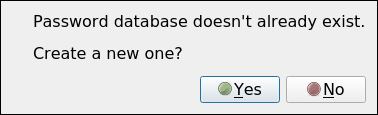
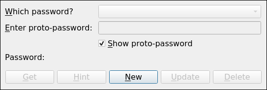
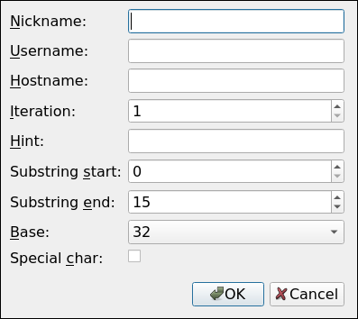
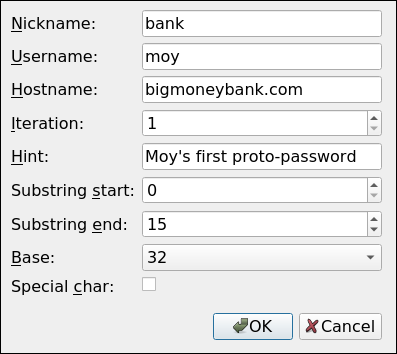
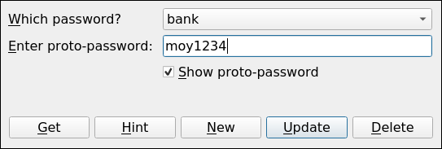
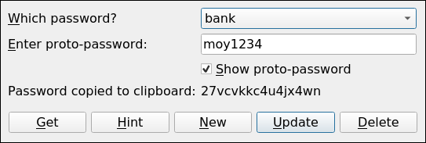

### Table of Contents

- <a href="#toc">Table of Contents</a>
- <a href="#probs">The Problem(s)</a>
- <a href="#soln">The Solution</a>
- <a href="#howto">How to Use this Program</a>
- <a href="#install">How to Install this Program</a>

### The Problem(s)

Four of the biggest obstacles to password security are:

- An easily-remembered password like 'moy1234' is also easily cracked.
- If people use cryptic passwords like 'asc#$89yu235,|jaa' then they're
  more likely to use the same password everywhere.
- If people do in fact use different cryptic passwords for different
  sites then they're more likely to write down their passwords in text
  files (usually unencrypted) so that they don't have to remember them
  all.
- Many sites expire passwords every so often.  This is great in
  theory, but in practice it makes people more likely to use patterns
  in their passwords (e.g. 'moy1234-[date-of-creation]') or to write
  them down.

### The Solution

KeyMaster doesn't store passwords, it stores metadata about passwords
(e.g. hostname, username or other mnemonic, etc.).  Each time you use
KeyMaster for, say, your bank, you give it the same (possibly
insecure) proto-password---like 'moy1234'.  It uses the proto-password
and other metadata about that particular password to deterministically
generate a cryptic password.  It also stores a password iteration
number, so if you need to expire a password you simply increment the
iteration number and KeyMaster gives you a whole new password.

It thus solves all four problems listed above:

- You don't actually use insecure passwords for any site; you use the
  automatically-generated cryptic password.
- Since it uses metadata as part of the password-generation key, the
  same proto-password produces different passwords for different
  sites, so if you like you can use the same proto-password and still
  automatically get password-diversity.
- Since you don't need to remember multiple hard-to-remember
  passwords, you don't need to write them down anywhere.  In fact,
  since KeyMaster doesn't store passwords at all (not even
  proto-passwords), an intruder who gets hold of your "password
  database" gets absolutely nothing they can use.
- The iteration number solves the password-expiration problem.

### How to Use this Program

- When you run KeyMaster the first time, it doesn't have any data
  yet, so it asks you if it should create a new database.

  
- Clicking OK takes us to the main screen, which is empty since the
  new database is still empty.  Everything's grayed out except
  the "New" button, which lets us create a new password object.

  
- Clicking the "New" button takes us to the password-creation screen.
  For each password we enter a mnemonic nickname, a username or other
  mnemonic, a hostname, an iteration number (defaults to 1), and a hint.
  The other three options are base 32 or 64 (32 allows only
  alphanumeric characters, 64 also allows special characters); whether
  we want special characters or not (since some sites don't allow
  them); and how long we want the password to be.  The length is
  specified by giving the start and end characters, with the default
  length being 16.

  
- We fill in the data for the site we want; for example moy uses Big
  Money Bank.

  
- Pressing "OK" takes us back to the main screen.  Since our database
  is no longer empty, the "Which password?" drop-down list is
  populated.  We can choose "bank", enter our insecure proto-password,
  and click "Get".  Since I'm at home and there's no one looking over
  my shoulder, I select the "show password" check-box so I can see
  what I'm typing.  Deselecting "show password" would hide the
  proto-password.

  
- Clicking "Get" returns the actual password.  By default, the program
  also copies the password to your clipboard.  Closing the program
  clears the clipboard.

  
